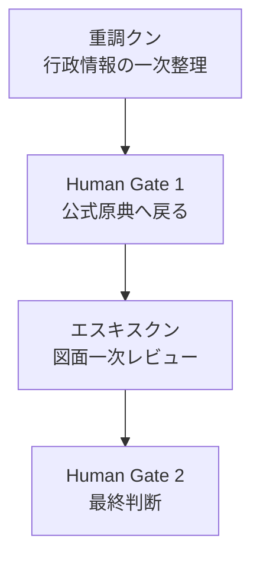
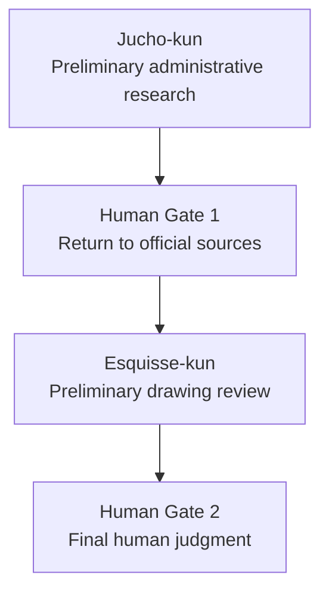

# 重調クン→エスキスクン 実機連携テスト
# Jucho-kun to Esquisse-kun Live Workflow Test

[日本語](#日本語) | [English](#english)

## 日本語

### 4.1 テスト概要

- 実施日：2026-08-13
- 実施環境：ChatGPT Work Mode
- 実行方法：同一会話内で `/jucho-kun` と `/エスキスクン` を順番に起動（ChatGPT Work Modeでのskills連続起動）
- 対象：千葉市新庁舎の公開基本設計資料
- 資料の扱い：link-only（PDF・画像・スクリーンショットは保存しない）
- 総合状態：スキル連携 **PASS** ／ Case 001全体 **PARTIAL**

このテストは、重調クンとエスキスクンが同一会話内で連続して起動し、それぞれの安全ルールに従って動作することを確認するものである。千葉市新庁舎という個別案件の法規適合性・安全性を確定するものではない。

### 4.2 実行フロー

Human Gate 1とHuman Gate 2のいずれかが未完了の間は、案件全体を`PASS`としない。本テストでは、Human Gate 1（公式原典との照合）とHuman Gate 2の一部項目は今回のスキル連携によって満たされたが、現在時点のGIS・ハザードマップの地点別確認と所管窓口・有資格者による最終確認は、Human Gate 2の残りの未完了項目として残っている。

### 4.3 入力

- 所在地：千葉市中央区千葉港1番1号
- 取引条件：売買想定
- 用途：事業用
- 権利形態：区分所有ではない
- 使用資料：千葉市が公開している新庁舎整備の基本設計図（PDF）、および基本設計図書【概要版】
- 設計資料の時点：2018年公開の基本設計段階資料（2026年時点の行政条件を証明するものではない）

### 4.4 出力

**重調クンの生成結果（確認できた事実のみ）**

- Excel報告書：4シート構成
- チェック項目：35項目（確認済 1件／要確認 26件／未着手 8件）
- 各項目に公式URL、行政窓口、電話番号、地図リンクを付与
- 2017〜2018年の設計条件と、2026年現在の未確認条件を分離して記録
- 図面や過去資料から現在の法規・ハザード条件を補完しなかった

**エスキスクンの実行結果（確認できた事実のみ）**

- 基本設計図の主要図面を実際に確認：PDF p.2（`A-01`）、p.11（`A-10`）、p.13（`A-12`）、p.14（`A-13`）、p.20（`A-19`）、p.21（`A-20`）
- 明示値・読取値・推定値・不明値を分離
- 設計上の主要論点を3件に限定して提示
- 法規項目を「確認できた・要確認・判定不能」の3分類で整理
- 不足情報について、追加先の図面と追加後に分かることを提示
- 安藤忠雄 Reference Architect Mode を実行し、作風や素材の模倣ではなく、次の設計原理として適用
  - 幾何と空間秩序
  - シークエンスとアプローチ
  - 自然との構築された関係

生成されたExcelファイルそのものは、本リポジトリへ追加しない。

### 4.5 テスト結果表

| Test ID | 内容 | 状態 |
|---|---|---|
| `LIVE-01` | ChatGPT上で `/jucho-kun` を起動 | `PASS` |
| `LIVE-02` | 一次スクリーニングとExcel生成 | `PASS` |
| `LIVE-03` | 同一会話で `/エスキスクン` へ引き継ぎ | `PASS` |
| `LIVE-04` | 公式基本設計図の主要図面レビュー | `PASS` |
| `LIVE-05` | 4分類・法規3分類・不足情報ナビ | `PASS` |
| `LIVE-06` | 安藤忠雄 Reference Architect Mode | `PASS` |
| `HUMAN-01` | 現在の都市計画GISの地点別確認 | `NOT RUN` |
| `HUMAN-02` | 最新ハザードマップの地点別確認 | `NOT RUN` |
| `HUMAN-03` | 所管窓口・建築士等による最終確認 | `NOT RUN` |

### 4.6 「PASSが意味すること／意味しないこと」

**PASSが意味すること**

- スキルが起動した
- 指定された入力を処理した
- 図面情報を4分類した
- 推定値を法規判断に使用しなかった
- 不足情報を具体的な次の確認へ変換した
- 重調クンの結果をエスキスクンへ引き継いだ

**PASSが意味しないこと**

- 現在の法規適合性
- 建物の安全性
- 確認申請図書との一致
- ハザードリスクの最終判定
- 行政・建築士・確認検査機関による確認完了

`PASS`は機能が所定の安全ルールに従って動いたことを意味し、現在の法規適合性や安全性を意味しない。

### 4.7 再現手順

第三者が同じテストを行うための手順は次のとおり。

1. 公式公開ページを開く。
2. 利用条件・著作権方針を確認する。
3. 公式PDFをユーザー自身がChatGPTへアップロードする。
4. `/jucho-kun` を起動する。
5. 所在地・取引条件・用途・権利形態の4項目を入力する。
6. 出力を人が公式原典と照合する（Human Gate 1）。
7. `/エスキスクン` を起動する。
8. 公式図面、重調クンの結果、確認済み条件を渡す。
9. 4分類・法規3分類・不足情報ナビを確認する。
10. 現在のGIS・ハザード・所管窓口を人が確認する（Human Gate 2）。

### 4.8 権利処理

- PDFは保存しない
- PDFページを画像化して掲載しない
- 公式サイトのスクリーンショットを掲載しない
- 元図面をトレースしない
- 生成Excelをリポジトリへ追加しない
- 公式URL、資料名、公開者、確認日、テスト結果のみ記録する

---

## English

### 4.1 Test Overview

- Date: 2026-08-13
- Environment: ChatGPT Work Mode
- Method: `/jucho-kun` and `/エスキスクン` invoked sequentially within the same conversation (sequential skill invocation in ChatGPT Work Mode)
- Target: Chiba City's public basic-design materials for the new city hall
- Handling of materials: link-only (no PDF, image, or screenshot is stored)
- Overall status: skill workflow **PASS** / Case 001 overall **PARTIAL**

This test confirms that Jucho-kun and Esquisse-kun can be invoked sequentially within the same conversation and that each operates according to its own safety rules. It does not establish current legal compliance or safety for the Chiba City Hall case itself.

### 4.2 Execution Flow

While either Human Gate 1 or Human Gate 2 remains incomplete, the case as a whole is not treated as `PASS`. In this test, Human Gate 1 (verification against official sources) and part of Human Gate 2 were satisfied through this skill run, but current parcel-level GIS and hazard-map verification and confirmation by the competent office and licensed professionals remain outstanding items of Human Gate 2.

### 4.3 Inputs

- Address: 1-1 Chibako, Chuo-ku, Chiba City
- Transaction condition: assumed sale
- Use: commercial/business
- Ownership type: not sectional (kubun-shoyu) ownership
- Materials used: Chiba City's publicly released basic-design drawing PDF for the new city hall, and the basic-design summary document
- Date of design materials: basic-design-stage documents published in 2018 (not a certification of current 2026 administrative conditions)

### 4.4 Outputs

**Jucho-kun results (confirmed facts only)**

- Excel report: 4 sheets
- Check items: 35 total (1 confirmed / 26 requiring verification / 8 not started)
- Each item annotated with official URLs, administrative contact points, phone numbers, and map links
- 2017–2018 design-stage conditions separated from unverified 2026 current conditions
- Current legal or hazard conditions were not inferred from drawings or historical materials

**Esquisse-kun results (confirmed facts only)**

- Reviewed the principal basic-design drawing sheets: PDF p.2 (`A-01`), p.11 (`A-10`), p.13 (`A-12`), p.14 (`A-13`), p.20 (`A-19`), and p.21 (`A-20`)
- Separated information into explicit, readable, estimated, and unknown values
- Limited the design review to three principal issues
- Classified code items into confirmed, requires-verification, and undetermined
- For missing information, identified which drawing to add information to and what could be determined afterward
- Applied the Tadao Ando Reference Architect Mode not as style or material imitation but as design principles:
  - Geometry and spatial order
  - Sequence and approach
  - Nature as a constructed relationship

The generated Excel file itself is not added to this repository.

### 4.5 Test Result Table

| Test ID | Content | Status |
|---|---|---|
| `LIVE-01` | Invoked `/jucho-kun` in ChatGPT | `PASS` |
| `LIVE-02` | Preliminary screening and Excel generation | `PASS` |
| `LIVE-03` | Handoff to `/エスキスクン` in the same conversation | `PASS` |
| `LIVE-04` | Review of the official basic-design drawing sheets | `PASS` |
| `LIVE-05` | Four information classes, three-way code classification, missing-information navigator | `PASS` |
| `LIVE-06` | Tadao Ando Reference Architect Mode | `PASS` |
| `HUMAN-01` | Current parcel-level urban-planning GIS verification | `NOT RUN` |
| `HUMAN-02` | Current parcel-level hazard-map verification | `NOT RUN` |
| `HUMAN-03` | Confirmation by the competent office and licensed professionals | `NOT RUN` |

### 4.6 What PASS Means and Does Not Mean

**What PASS means**

- The skill was invoked
- The specified input was processed
- Drawing information was separated into four classes
- Estimated values were not used for legal judgment
- Missing information was converted into concrete next verification steps
- Jucho-kun's results were handed off to Esquisse-kun

**What PASS does not mean**

- Current legal compliance
- Building safety
- Consistency with formal building-confirmation (kakunin-shinsei) documents
- A final determination of hazard risk
- Confirmation completed by administrative authorities, architects, or inspection bodies

`PASS` means the feature operated according to its defined safety rules; it does not mean current legal compliance or safety.

### 4.7 Reproduction Steps

To allow a third party to reproduce this test:

1. Open the official public page.
2. Review the terms of use and copyright policy.
3. Have the user upload the official PDF to ChatGPT themselves.
4. Invoke `/jucho-kun`.
5. Enter the four inputs: address, transaction condition, use, and ownership type.
6. Have a human verify the output against official sources (Human Gate 1).
7. Invoke `/エスキスクン`.
8. Pass in the official drawings, the Jucho-kun results, and the verified conditions.
9. Review the four information classes, the three-way code classification, and the missing-information navigator.
10. Have a human verify the current GIS, hazard maps, and competent office (Human Gate 2).

### 4.8 Rights Handling

- Do not store the PDF
- Do not publish images converted from PDF pages
- Do not publish screenshots of the official website
- Do not trace the original drawings
- Do not add the generated Excel file to the repository
- Record only the official URL, document title, publisher, verification date, and test result
